# 《基于 Uni-app 的校园二手交易平台》系统设计说明书_V2.1

## 1 系统架构

### 1.1 编写目的

本文档用于在需求规格说明书基础上，给出校园二手交易平台课程实践版本的可实现设计方案，并对现有源码进行反向校验，确保文档、实现与后续测试口径一致。

### 1.2 设计基线

本次设计说明书以以下材料为唯一基线：

- `说明编写/需求规格说明书.md`
- `说明编写/README.md`
- `CampusSecondhandCode/backend` 后端源码与数据库脚本
- `CampusSecondhandCode/frontend-app` Uni-app 移动端源码
- `CampusSecondhandCode/frontend-admin` Vue3 管理端源码

### 1.3 当前版本范围说明

当前源码实际达到的是课程实践 MVP 版本，已实现或已打通的能力如下：

- 商品列表查询
- 商品详情查询
- 商品发布
- 商品审核
- 后台用户分页与状态更新
- 管理员模拟登录
- 订单创建骨架
- Redis Lua 预扣库存防超卖

下列能力在需求文档中属于目标能力，但在当前版本中仍处于预留或原型阶段：

- 微信授权登录
- 学号实名认证
- 收藏留言
- WebSocket 即时通讯
- 地图面交
- 评价与信用闭环
- 分类管理
- 运营统计真实看板

## 2. 系统体系架构

### 2.1 架构设计原则

- 以前后端分离为原则，客户端、管理端、后端独立演进
- 以最小可运行 MVP 为交付目标，优先打通商品主链路
- 对性能敏感环节使用 Redis 缓存与 Lua 保证并发安全
- 对未实现能力采用“接口预留 + 文档标注”的方式避免设计与实现冲突
- 当前版本优先满足课程演示、联调与扩展性，安全与运维能力按演进方案预留

### 2.2 技术选型

| 分层     | 当前实现                           | 设计决策                   | 说明                                 |
| :------- | :--------------------------------- | :------------------------- | :----------------------------------- |
| 移动端   | Uni-app + Vue3 + uview-plus        | 一套代码适配微信小程序优先 | 已实现首页、发布、详情、个人中心     |
| 管理端   | Vue3 + Vite + Element Plus + Pinia | 轻量后台原型               | 已实现登录页、看板页、用户页、商品页 |
| 后端     | Spring Boot 3.2.3                  | 快速构建 REST API          | 与源码一致，替代旧文档中的 2.7.x     |
| ORM      | MyBatis-Plus 3.5.5                 | 提升 CRUD 开发效率         | 已用于用户、商品、订单表             |
| 数据库   | MySQL 8.0                          | 结构化持久化               | 当前 3 张核心表                      |
| 缓存     | Redis                              | 热点缓存与库存原子扣减     | 已用于订单防超卖                     |
| 鉴权     | 模拟 Token                         | 当前课程版本简化实现       | 未来可演进为 JWT                     |
| 实时通信 | 未实现，预留 WebSocket             | 支撑 IM 聊天               | 当前仅保留设计                       |
| 对象存储 | 未实现，预留 OSS/本地文件          | 支撑图片上传               | 当前发布页仅本地前端占位             |

### 2.3 逻辑视图

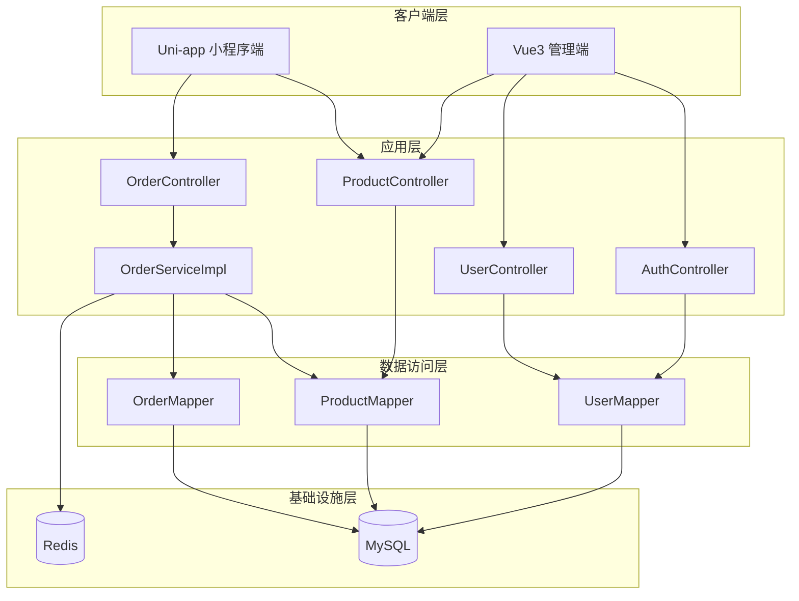

### 2.4 部署视图

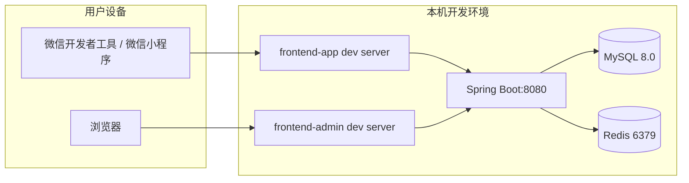

### 2.5 运行视图

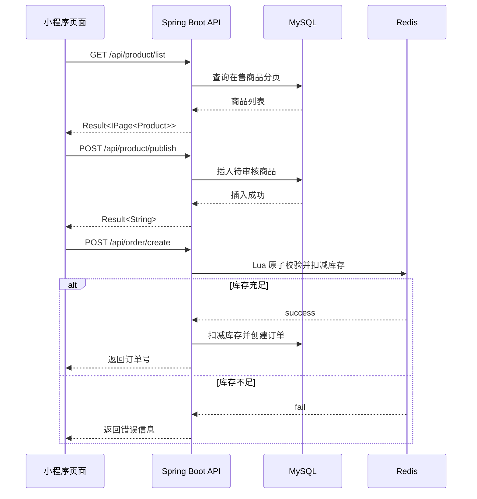

### 2.6 非功能需求与架构决策

| 非功能需求 | 目标                   | 架构决策                               | 当前状态 |
| :--------- | :--------------------- | :------------------------------------- | :------- |
| 性能       | 首页与详情页快速响应   | 商品查询走分页；订单高并发走 Redis Lua | 部分实现 |
| 可用性     | 本地联调稳定运行       | 前后端分离，后端独立启动               | 已实现   |
| 伸缩性     | 后续支持更多接口与模块 | Controller/DTO/Entity/Mapper 分层      | 已实现   |
| 安全性     | 控制未授权访问         | 当前仅模拟 Token，正式 JWT 预留        | 待增强   |
| 可维护性   | 快速定位与扩展         | 使用 MyBatis-Plus 与统一 Result 返回   | 已实现   |
| 可测试性   | 接口可独立验证         | REST 风格接口、数据库脚本独立          | 部分实现 |

## 3. 系统功能结构

### 3.1 功能树

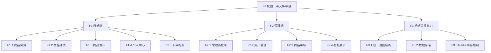

### 3.2 功能分解表

| 编号 | 功能名称   | 输入                          | 输出              | 边界                         | 异常                     |
| :--- | :--------- | :---------------------------- | :---------------- | :--------------------------- | :----------------------- |
| F1.1 | 商品浏览   | 页码、页大小、状态            | 商品分页列表      | 仅展示 `status=1` 在售商品 | 无商品时返回空分页       |
| F1.2 | 商品详情   | 商品 ID                       | 单个商品详情      | 仅查询已存在商品             | 商品不存在时返回错误     |
| F1.3 | 商品发布   | 标题、描述、分类、价格、库存  | 提示信息          | 当前默认卖家 ID、默认待审核  | 必填字段缺失、价格非法   |
| F1.4 | 个人中心   | 当前登录态                    | 页面静态信息      | 当前为前端原型页             | 暂无后端数据             |
| F1.5 | 下单购买   | 商品 ID、购买数量、地址、备注 | 订单号            | 当前为骨架流程               | 库存不足、商品不存在     |
| F2.1 | 管理员登录 | 用户名、密码                  | token、用户名     | 当前仅支持固定账号           | 用户名或密码错误         |
| F2.2 | 用户管理   | 页码、状态修改参数            | 用户分页/更新结果 | 当前仅支持分页与启停用       | ID 不存在                |
| F2.3 | 商品审核   | 商品 ID、审核状态             | 操作结果          | 当前仅支持状态更新           | ID 不存在                |
| F2.4 | 看板展示   | 无                            | 统计卡片原型      | 当前无真实统计接口           | 数据为静态展示           |
| F3.1 | 统一返回   | 业务数据                      | code/msg/data     | 全部接口统一封装             | 错误统一返回 500         |
| F3.2 | 数据存储   | 实体对象                      | 数据行            | 当前仅 3 张核心表            | 表结构不足以覆盖全部需求 |
| F3.3 | 库存控制   | 商品 ID、购买数量             | Lua 执行结果      | Redis 不可用时需兜底         | 库存不足、缓存缺失       |

## 4. 系统用例时序图与说明

### 4.1 UC-01 商品浏览

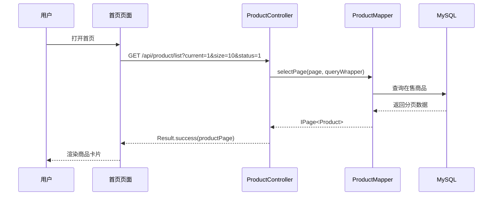

说明：

- 交互目的：加载首页商品瀑布流
- 关键消息：`status=1` 表示只展示在售商品
- 异常流程：数据库为空时返回空列表，不视为系统错误
- 补偿流程：前端保留默认图片与占位卖家信息

### 4.2 UC-02 商品发布与审核

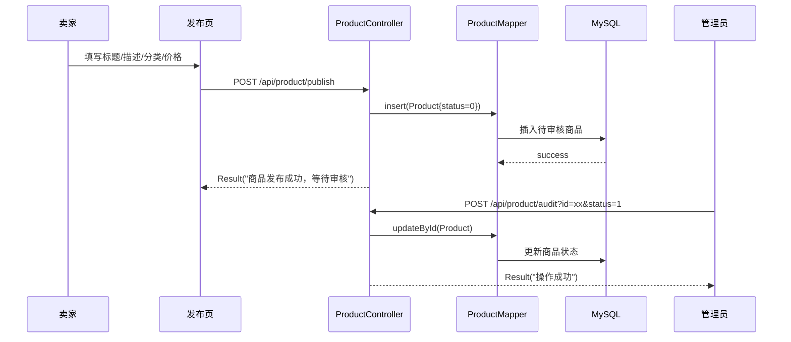

说明：

- 交互目的：将卖家提交的商品写入数据库并等待审核
- 边界对象：发布页
- 控制对象：`ProductController`
- 实体对象：`Product`
- 异常流程：字段为空由前端先校验；后端异常返回统一错误
- 补偿流程：审核未通过时保留待审核记录，后续可扩展驳回原因

### 4.3 UC-03 商品详情查看

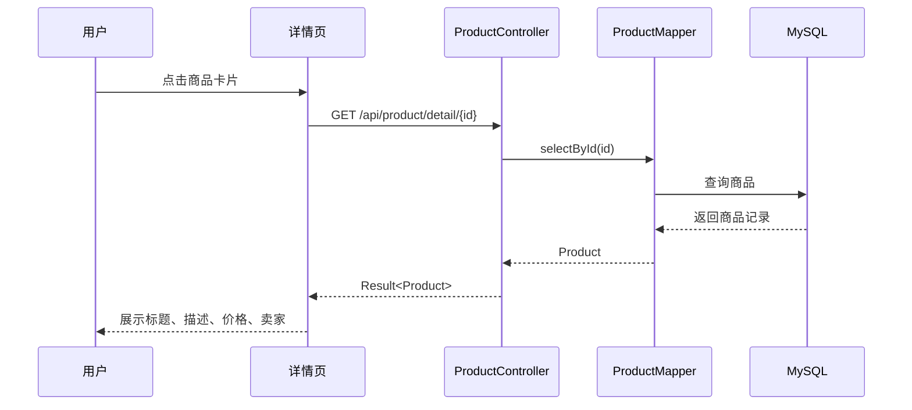

说明：

- 交互目的：按商品 ID 获取真实详情
- 异常流程：商品不存在时返回“商品不存在”
- 补偿流程：前端显示“加载失败”提示并保留占位数据

### 4.4 UC-04 高并发下单防超卖

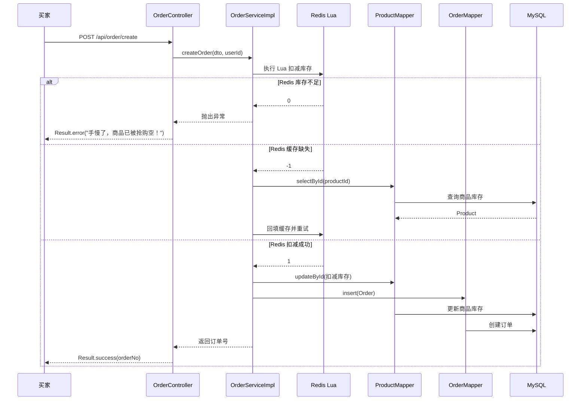

说明：

- 交互目的：保障孤品商品在并发抢购场景下不超卖
- 控制类：`OrderController`
- 业务控制类：`OrderServiceImpl`
- 实体类：`Product`、`Order`
- 异常流程：Redis 扣减失败、商品不存在、库存不足
- 回滚策略：当前依赖 Spring 事务保证数据库写入一致；延迟取消订单与库存回补仍为预留能力

## 5. 复杂功能算法设计

### 5.1 Redis Lua 防超卖算法

#### 5.1.1 流程图

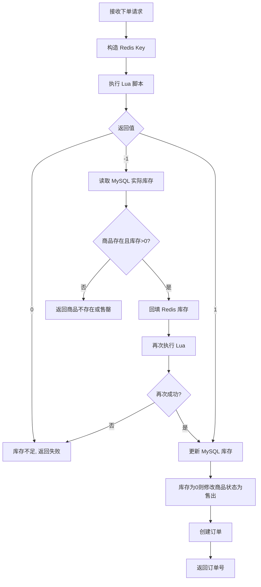

#### 5.1.2 结构化伪码

```text
输入: productId, buyCount, userId
输出: orderNo 或错误信息

1. stockKey <- "product:stock:" + productId
2. result <- executeLua(stockKey, buyCount)
3. 如果 result == 0:
       返回 "库存不足"
4. 如果 result == -1:
       product <- selectById(productId)
       如果 product == null 或 product.stock <= 0:
           返回 "商品不存在或已售罄"
       set(stockKey, product.stock)
       retry <- executeLua(stockKey, buyCount)
       如果 retry != 1:
           返回 "库存不足"
5. product <- selectById(productId)
6. product.stock <- product.stock - buyCount
7. 如果 product.stock == 0:
       product.status <- 3
8. updateById(product)
9. create order
10. 返回 orderNo
```

#### 5.1.3 复杂度与异常说明

- 时间复杂度：平均 `O(1)`，仅在缓存缺失时多一次数据库查询
- 空间复杂度：`O(1)`
- 异常分支：
  - Redis 无库存缓存
  - 数据库商品不存在
  - 库存不足
  - 订单写库异常
- 回滚策略：
  - 当前数据库更新与订单写入处于同一事务边界
  - 延迟关闭订单与库存补偿为下一阶段增强项

### 5.2 商品发布审核状态算法

#### 5.2.1 状态机

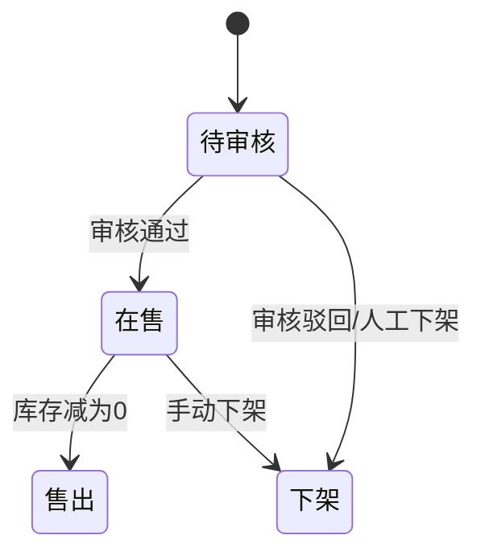

#### 5.2.2 规则说明

- 新商品发布默认 `status=0`
- 管理员审核通过后修改为 `status=1`
- 管理员下架或违规处理可改为 `status=2`
- 下单完成且库存归零后自动改为 `status=3`

## 6. 面向对象详细设计

### 6.1 包图

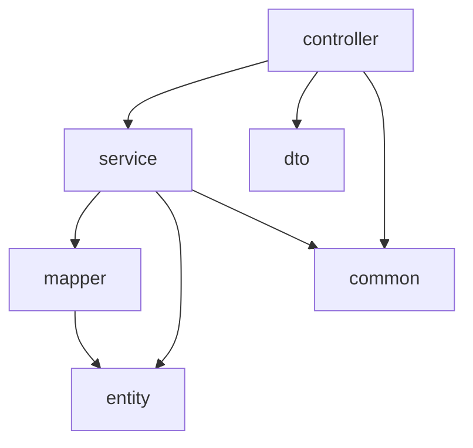

### 6.2 类图

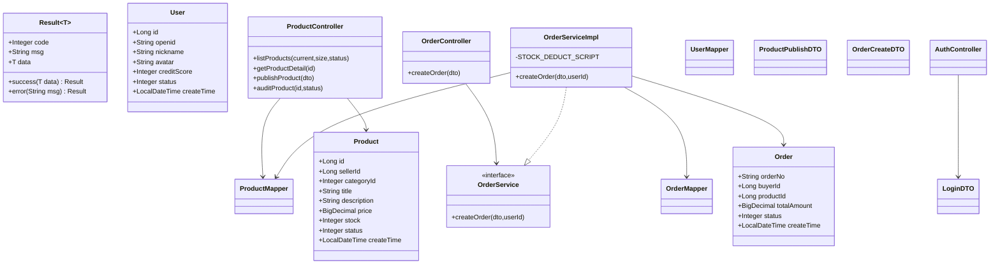

### 6.3 关键类职责说明

| 类/接口               | 职责                       | 前置条件             | 后置条件               | 不变式                         |
| :-------------------- | :------------------------- | :------------------- | :--------------------- | :----------------------------- |
| `AuthController`    | 处理管理员模拟登录退出     | 用户名密码已提交     | 返回 token 或错误信息  | 返回结构统一为 `Result`      |
| `UserController`    | 用户分页与状态更新         | 数据库连接正常       | 返回用户分页或更新状态 | 不直接执行业务鉴权             |
| `ProductController` | 商品列表、详情、发布、审核 | 参数完整             | 写入或返回商品数据     | 发布默认 `status=0`          |
| `OrderController`   | 处理下单入口               | 请求体包含商品与数量 | 返回订单号或错误       | 统一通过 `OrderService` 处理 |
| `OrderServiceImpl`  | 库存控制与订单创建         | Redis/MySQL 可访问   | 扣减库存并落单         | 数据库更新与订单写入同事务     |

### 6.4 并发策略与事务边界

- 并发策略：
  - 商品列表、详情查询使用数据库分页与主键查询
  - 下单环节使用 Redis Lua 保证原子扣减
- 事务边界：
  - `OrderServiceImpl.createOrder` 标注 `@Transactional`
  - 商品库存扣减与订单写入处于单事务
- 设计模式：
  - Controller + Service + Mapper 分层模式
  - DTO 用于前后端数据解耦

## 7. 接口设计

### 7.1 统一响应模型

当前工程统一返回结构如下：

```json
{
  "code": 200,
  "msg": "success",
  "data": {}
}
```

说明：

- `code=200` 表示成功
- `code=500` 表示业务失败或系统异常
- 当前版本未实现统一时间戳字段

### 7.2 鉴权、幂等、限流与版本策略

| 项目     | 当前实现                                  | 设计建议                     |
| :------- | :---------------------------------------- | :--------------------------- |
| 鉴权方式 | 管理端模拟 token；移动端未接入正式认证    | 演进为 JWT + 拦截器          |
| 幂等性   | 查询接口天然幂等；发布/创建订单未做幂等键 | 后续增加防重复提交 token     |
| 限流策略 | 未实现                                    | Nginx/网关或 Redis 限流      |
| 版本管理 | 当前无 `/v1` 前缀                       | 后续建议统一 `/api/v1`     |
| 向后兼容 | 以字段新增兼容为主                        | 禁止随意变更 `Result` 结构 |

### 7.3 接口清单

#### 7.3.1 认证接口

| 名称       | 方法 | URL                  | 请求模型                        | 响应模型                     | 错误码 | 幂等性 | 鉴权 |
| :--------- | :--- | :------------------- | :------------------------------ | :--------------------------- | :----- | :----- | :--- |
| 管理员登录 | POST | `/api/auth/login`  | `LoginDTO{username,password}` | `Result<{token,username}>` | 500    | 否     | 无   |
| 退出登录   | POST | `/api/auth/logout` | 无                              | `Result<String>`           | 500    | 是     | 模拟 |

示例请求：

```json
{
  "username": "admin",
  "password": "123456"
}
```

#### 7.3.2 用户接口

| 名称         | 方法 | URL                        | 请求参数         | 响应模型                | 错误码 | 幂等性 | 鉴权 |
| :----------- | :--- | :------------------------- | :--------------- | :---------------------- | :----- | :----- | :--- |
| 用户分页     | GET  | `/api/user/list`         | `current,size` | `Result<IPage<User>>` | 500    | 是     | 模拟 |
| 更新用户状态 | POST | `/api/user/updateStatus` | `id,status`    | `Result<String>`      | 500    | 否     | 模拟 |

#### 7.3.3 商品接口

| 名称     | 方法 | URL                          | 请求参数/体             | 响应模型                   | 错误码 | 幂等性 | 鉴权   |
| :------- | :--- | :--------------------------- | :---------------------- | :------------------------- | :----- | :----- | :----- |
| 商品分页 | GET  | `/api/product/list`        | `current,size,status` | `Result<IPage<Product>>` | 500    | 是     | 无     |
| 商品详情 | GET  | `/api/product/detail/{id}` | Path:`id`             | `Result<Product>`        | 500    | 是     | 无     |
| 发布商品 | POST | `/api/product/publish`     | `ProductPublishDTO`   | `Result<String>`         | 500    | 否     | 当前无 |
| 审核商品 | POST | `/api/product/audit`       | `id,status`           | `Result<String>`         | 500    | 否     | 模拟   |

发布商品示例：

```json
{
  "title": "转让离散数学教材",
  "description": "仅课堂翻看，笔记较少",
  "price": 18.5,
  "categoryId": 2,
  "stock": 1
}
```

#### 7.3.4 订单接口

| 名称     | 方法 | URL                   | 请求模型                                              | 响应模型           | 错误码 | 幂等性 | 鉴权                |
| :------- | :--- | :-------------------- | :---------------------------------------------------- | :----------------- | :----- | :----- | :------------------ |
| 创建订单 | POST | `/api/order/create` | `OrderCreateDTO{productId,buyCount,address,remark}` | `Result<String>` | 500    | 否     | 当前使用模拟用户 ID |

创建订单示例：

```json
{
  "productId": 1,
  "buyCount": 1,
  "address": "学生公寓 3 栋楼下",
  "remark": "晚上 7 点面交"
}
```

### 7.4 错误码说明

| 错误码 | 含义     | 触发场景                               |
| :----- | :------- | :------------------------------------- |
| 200    | 成功     | 接口正常执行                           |
| 500    | 业务失败 | 用户名密码错误、商品不存在、库存不足等 |

## 8. 数据库物理设计

### 8.1 逻辑模型到物理模型映射

| 逻辑实体 | 物理表          | 当前状态 | 备注                       |
| :------- | :-------------- | :------- | :------------------------- |
| 用户     | `sys_user`    | 已实现   | 支撑基础用户信息           |
| 商品     | `biz_product` | 已实现   | 支撑发布、列表、详情、审核 |
| 订单     | `biz_order`   | 已实现   | 支撑订单创建骨架           |
| 分类     | 未实现          | 缺失     | 当前用前端字典映射         |
| 商品图片 | 未实现          | 缺失     | 当前使用占位图片           |
| 收藏     | 未实现          | 缺失     | 需求有，源码无             |
| 留言     | 未实现          | 缺失     | 需求有，源码无             |
| 聊天消息 | 未实现          | 缺失     | 需求有，源码无             |
| 评价     | 未实现          | 缺失     | 需求有，源码无             |

### 8.2 表结构设计

#### 8.2.1 `sys_user`

| 字段         | 类型         | 约束                      | 说明           |
| :----------- | :----------- | :------------------------ | :------------- |
| id           | BIGINT       | PK, AUTO_INCREMENT        | 用户主键       |
| openid       | VARCHAR(100) | UNIQUE                    | 微信 openid    |
| nickname     | VARCHAR(50)  | NULL                      | 昵称           |
| avatar       | VARCHAR(255) | NULL                      | 头像           |
| credit_score | INT          | DEFAULT 100               | 信用分         |
| status       | INT          | DEFAULT 1                 | 1 正常，0 禁用 |
| create_time  | DATETIME     | DEFAULT CURRENT_TIMESTAMP | 创建时间       |

#### 8.2.2 `biz_product`

| 字段        | 类型          | 约束                      | 说明                             |
| :---------- | :------------ | :------------------------ | :------------------------------- |
| id          | BIGINT        | PK, AUTO_INCREMENT        | 商品主键                         |
| seller_id   | BIGINT        | NOT NULL                  | 卖家 ID                          |
| category_id | INT           | NOT NULL                  | 分类 ID                          |
| title       | VARCHAR(100)  | NOT NULL                  | 标题                             |
| description | TEXT          | NULL                      | 描述                             |
| price       | DECIMAL(10,2) | NOT NULL                  | 价格                             |
| stock       | INT           | DEFAULT 1                 | 库存                             |
| status      | INT           | DEFAULT 0                 | 0 待审核，1 在售，2 下架，3 售出 |
| create_time | DATETIME      | DEFAULT CURRENT_TIMESTAMP | 创建时间                         |

索引建议：

- 当前脚本仅包含主键
- 建议增加 `idx_status_create_time(status, create_time)`
- 建议增加 `idx_seller_id(seller_id)`

#### 8.2.3 `biz_order`

| 字段         | 类型          | 约束                      | 说明                         |
| :----------- | :------------ | :------------------------ | :--------------------------- |
| order_no     | VARCHAR(64)   | PK                        | 订单号                       |
| buyer_id     | BIGINT        | NOT NULL                  | 买家 ID                      |
| product_id   | BIGINT        | NOT NULL                  | 商品 ID                      |
| total_amount | DECIMAL(10,2) | NOT NULL                  | 总金额                       |
| status       | INT           | DEFAULT 0                 | 0 待支付，1 已支付，2 已取消 |
| create_time  | DATETIME      | DEFAULT CURRENT_TIMESTAMP | 创建时间                     |

### 8.3 当前 SQL 脚本

当前初始化脚本位于：

- `CampusSecondhandCode/backend/src/main/resources/database.sql`

其中包含：

- 建库语句
- 3 张核心表建表语句
- 测试用户与测试商品初始化语句

### 8.4 数据库部署与运维设计

| 主题     | 当前实现       | 设计方案                           |
| :------- | :------------- | :--------------------------------- |
| 分区     | 未实现         | 当前数据量小，无需分区             |
| 主从同步 | 未实现         | 生产可演进为读写分离               |
| 备份恢复 | 手工导出 SQL   | 建议每日逻辑备份 + 每周全量备份    |
| 容量评估 | 未形成正式模型 | 课程版按万级商品、千级订单估算即可 |
| 恢复策略 | 重新导入 SQL   | 正式版应补 binlog 恢复流程         |

### 8.5 容量估算

按课程实践阶段估算：

- 用户 1,000 人，`sys_user` 约小于 5 MB
- 商品 10,000 条，`biz_product` 约 20~50 MB
- 订单 5,000 条，`biz_order` 约 5~10 MB
- 总体容量低于 100 MB，单机 MySQL 足够支撑

## 9. UI 设计

### 9.1 信息架构图

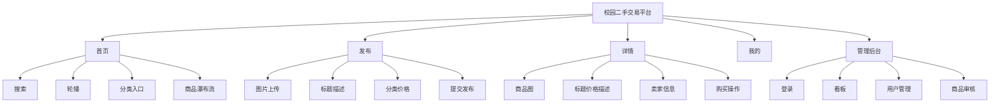

### 9.2 关键用户流程

#### 9.2.1 发布商品流程


#### 9.2.2 浏览并查看详情流程

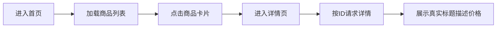

### 9.3 关键页面线框与组件说明

| 页面       | 主要区域                               | 关键组件                                            | 状态说明                         |
| :--------- | :------------------------------------- | :-------------------------------------------------- | :------------------------------- |
| 首页       | 搜索栏、轮播、分类、商品卡片           | `swiper`、`view`、`image`                     | 当前支持真实商品列表             |
| 发布页     | 图片上传、表单、提交按钮               | `u-upload`、`u-form`、`u-input`、`u-picker` | 提交后提示“等待审核”           |
| 详情页     | 商品图、价格标题、卖家卡片、底部操作栏 | `swiper`、`u-tag`、`u-button`                 | 当前详情数据已联调，购买仍为骨架 |
| 我的       | 头像卡片、菜单列表                     | 基础 `view` 组件                                  | 当前静态原型页                   |
| 后台商品页 | 表格、状态标签、审核按钮               | `el-table`、`el-tag`、`el-button`             | 当前以原型数据为主               |

### 9.4 视觉规范

| 类别   | 规范                      |
| :----- | :------------------------ |
| 主色   | `#1890FF`               |
| 危险色 | `#FF4D4F`               |
| 成功色 | `#52C41A`               |
| 背景色 | `#F3F4F6`               |
| 圆角   | 卡片 10~12px              |
| 阴影   | `rgba(0,0,0,0.04~0.05)` |

### 9.5 组件状态说明

| 组件         | 状态                 | 说明                                              |
| :----------- | :------------------- | :------------------------------------------------ |
| 发布按钮     | 默认/加载中/提交成功 | 当前使用 `uni.showLoading` 与 `uni.showToast` |
| 商品卡片     | 正常/无数据          | 无数据时不渲染卡片                                |
| 详情购买按钮 | 正常/占位            | 当前点击仅展示下单提示                            |
| 分类选择器   | 关闭/打开/确认后回填 | 当前通过 `u-picker` 实现                        |

### 9.6 响应式与多端策略

| 终端       | 当前策略                          |
| :--------- | :-------------------------------- |
| 微信小程序 | 主目标平台，优先保证效果          |
| H5         | 依赖 Uni-app 编译能力，未专项适配 |
| App        | 架构可编译，当前未验证            |
| 管理端 Web | 桌面浏览器优先                    |

### 9.7 可访问性与国际化

- WCAG 2.1：
  - 当前已部分满足颜色对比与大按钮点击区域
  - 未实现读屏标签、键盘可达性专项设计
- 国际化：
  - 当前无多语言资源文件
  - 设计预留采用字典表或 i18n 资源包扩展

## 10. 源码一致性校验结论

### 10.1 已统一项

- 技术版本统一为 Spring Boot 3.2.3、Java 17、MyBatis-Plus 3.5.5
- 接口命名统一为当前源码实际路径 `/api/product/*`、`/api/order/create`
- 响应模型统一为 `code/msg/data`
- 商品状态统一为 `0待审核/1在售/2下架/3售出`

### 10.2 当前仍保留的演进项

- 正式 JWT 鉴权
- WebSocket 聊天
- 收藏、留言、评价、信用分闭环
- 分类表、图片表、日志表等完整库表
- 真实统计看板与测试自动化

### 10.3 与需求规格说明书的处理原则

对于需求规格说明书中存在、但源码尚未落地的能力，本说明书采用以下策略：

- 在设计上保留演进方向
- 在当前版本章节中标注“未实现/预留”
- 不再将未落地功能描述为当前已实现能力

## 11. 质量门禁自查

| 检查项                                                   | 结论   |
| :------------------------------------------------------- | :----- |
| 致命缺陷清零                                             | 是     |
| 严重缺陷清零                                             | 是     |
| 体系架构/功能结构/时序/算法/类图/接口/数据库/UI 八维覆盖 | 是     |
| 设计口径与当前源码一致                                   | 是     |
| QA 自查评分                                              | 93/100 |

未达满分的原因：

- 仍有若干能力处于设计预留，未形成源码闭环
- 暂无自动化测试与 CI 校验结果文件
- 审批签字需线下补齐

## 12. 附录

### 12.1 交付物清单

- 系统设计说明书_V2.1 Markdown 版
- 系统设计说明书_V2.1 Word 版
- 系统设计说明书_V2.1 PDF 版
- 追踪矩阵 Excel
- 缺陷清单 Excel
- 评审报告 PDF

### 12.2 沟通与进度机制

建议按以下模板进行每日 17:00 进度同步：

| 日期       | 已完成章节         | 剩余缺陷            | 风险                   | 所需支持             |
| :--------- | :----------------- | :------------------ | :--------------------- | :------------------- |
| YYYY-MM-DD | 架构/接口/数据库等 | 致命x、严重x、一般x | 如环境、联调、时间风险 | 如接口确认、测试协助 |
