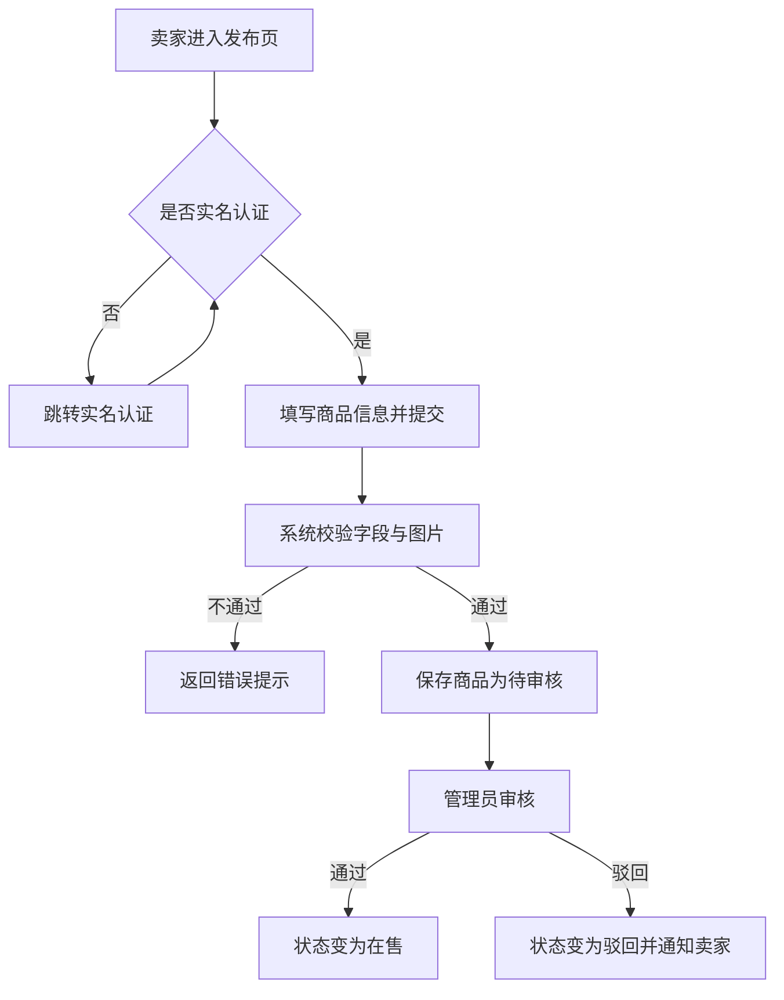
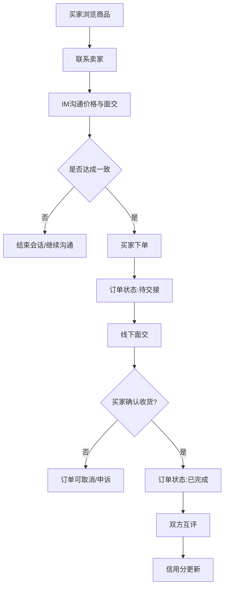
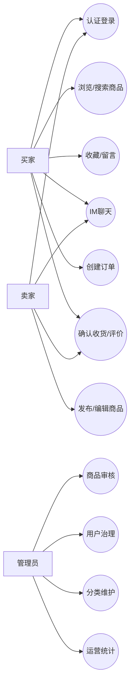
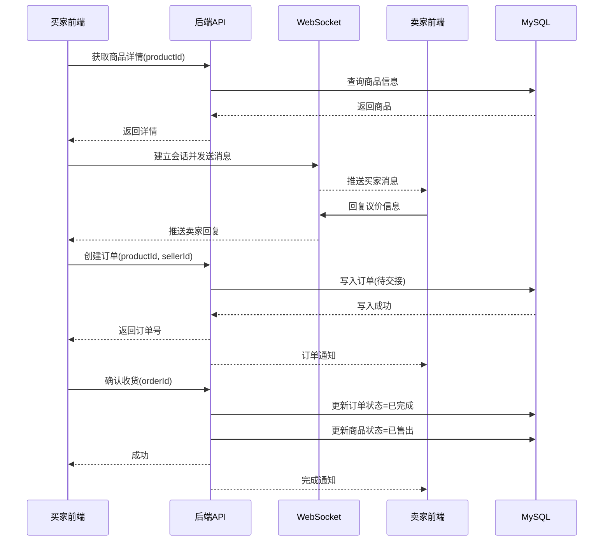
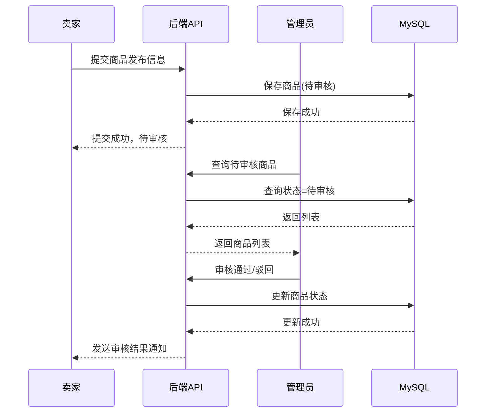
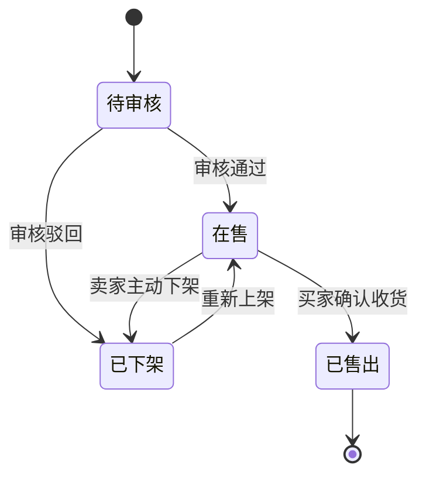
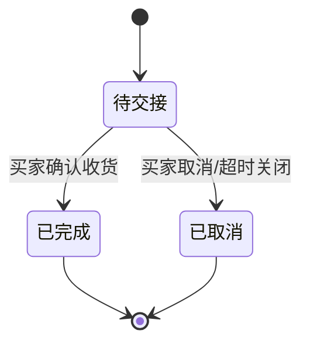
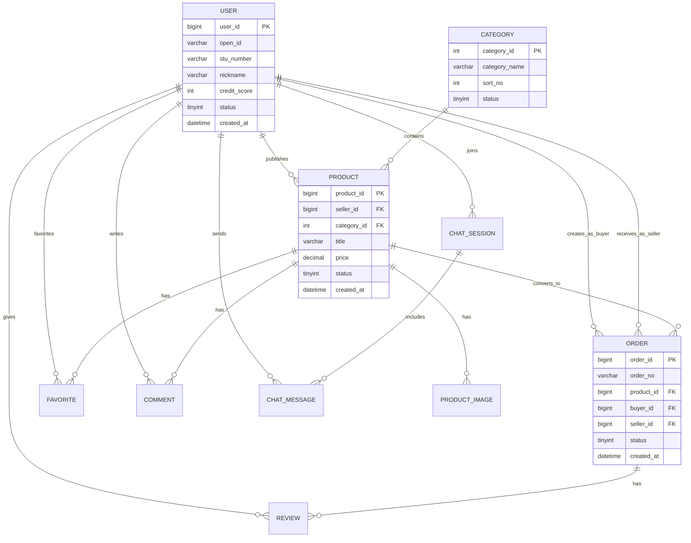

# 《基于 Uni-app 的校园二手交易平台》需求规格说明书（SRS）

## 文档信息

| 项目 | 内容 |
| :-- | :-- |
| 文档名称 | 校园二手交易平台需求规格说明书 |
| 文档版本 | V2.0 |
| 文档状态 | 评审版 |
| 编写日期 | 2026-03-21 |
| 适用课程 | 计算机综合项目实践 |
| 项目规模 | 2 人团队 |

---

## 0. 引言

### 0.1 编写目的
本文档用于明确基于 Uni-app 的校园二手交易平台在课程实践阶段的完整需求边界，作为后续系统设计、开发、测试、验收的统一依据，确保团队在功能目标、交付物和评估标准上保持一致。

### 0.2 项目背景
校园内存在大量闲置物品（教材、电子产品、生活用品），现有交易方式分散在微信群、朋友圈、贴吧，存在信息不对称、沟通效率低、信任成本高等问题。本项目拟建设一个校园实名制二手交易系统，支持“发布-沟通-下单-面交-评价”闭环。

### 0.3 术语与缩略语

| 术语 | 说明 |
| :-- | :-- |
| Uni-app | 跨端前端开发框架，可编译 H5/微信小程序/App |
| PO | Product Owner，产品负责人 |
| Scrum Master | 敏捷流程推进者，负责节奏与障碍清除 |
| JWT | 基于 Token 的身份认证机制 |
| LBS | 基于位置服务（地图定位） |
| IM | 即时通信（聊天） |
| SRS | Software Requirements Specification，需求规格说明书 |

### 0.4 参考依据
- 课程给定项目实践进度、课程考核、组队规则要求
- 前瞻报告（选题、技术路线、成员分工）
- 团队当前技术能力边界（Uni-app + Spring Boot + MySQL + Redis）

---

## 1. 用户需求说明

### 1.1 目标用户与角色划分

| 角色 | 说明 | 核心目标 |
| :-- | :-- | :-- |
| 普通用户（买家/卖家） | 校内学生，完成交易闭环 | 高效、安全完成二手交易 |
| 管理员 | 负责内容审核与平台治理 | 保证平台秩序与数据可视化 |
| 教师/验收方（间接） | 关注过程与结果 | 可验证团队成员贡献与系统质量 |

### 1.2 用户痛点与业务需求
1. 信息分散，商品难检索：需要统一分类、搜索和推荐。
2. 信任不足，交易风险高：需要实名制与信用机制。
3. 沟通效率低：需要站内 IM 即时交流。
4. 线下交付不便：需要地图面交点与订单状态记录。
5. 管理难度大：需要后台审核与违规处置能力。

### 1.3 业务范围（In Scope / Out of Scope）

#### 1.3.1 范围内（In Scope）
- 用户登录与实名认证（微信授权 + 学号认证）
- 商品发布、编辑、下架、上架、售出状态管理
- 分类浏览、关键词搜索、收藏、留言
- IM 聊天、下单、确认收货、评价
- 管理端：用户管理、商品审核、分类配置、数据看板

#### 1.3.2 范围外（Out of Scope）
- 真实线上支付（课程阶段使用线下面交）
- 第三方物流系统对接
- 跨校交易网络互联
- 深度机器学习推荐（仅保留轻量推荐策略）

### 1.4 用户故事（User Story）与验收标准

#### 1.4.1 普通用户（买家/卖家）

- **US-01 注册认证**
  - 作为一名学生，我希望通过微信授权 + 学号认证完成身份确认，以便让交易双方可信。
  - 验收标准：
    - 未认证用户不可发布商品；
    - 认证成功后可进入发布页；
    - 认证失败有明确提示。

- **US-02 商品发布**
  - 作为卖家，我希望上传图片、填写描述、设置价格与分类并标记面交地点，以便提升成交率。
  - 验收标准：
    - 图片至少 1 张，支持最多 9 张；
    - 标题、价格、分类必填；
    - 提交后商品状态为待审核或在售。

- **US-03 商品检索**
  - 作为买家，我希望按分类、关键词、推荐和地图查看商品，以便快速找到目标物品。
  - 验收标准：
    - 搜索结果支持分页；
    - 分类筛选与关键词可叠加；
    - 地图模式展示可点击商品卡片。

- **US-04 交易沟通**
  - 作为买卖双方，我希望使用站内 IM（文字/图片/位置）沟通并生成订单，以便减少跳转与隐私泄露。
  - 验收标准：
    - 双方在线时消息实时到达；
    - 支持历史消息加载；
    - 可在聊天页触发立即购买。

- **US-05 订单闭环**
  - 作为买家，我希望在面交后确认收货并评价，以便完成交易并沉淀信用记录。
  - 验收标准：
    - 订单状态正确流转（待交接→已完成/已取消）；
    - 完成后商品状态自动变更为已售出；
    - 支持双方评价与信用分更新。

#### 1.4.2 管理员

- **US-06 用户治理**
  - 作为管理员，我希望对违规用户进行警告、扣分、封禁，以维护平台秩序。
- **US-07 商品审核**
  - 作为管理员，我希望审核商品并处理违规内容，避免不良信息传播。
- **US-08 分类维护**
  - 作为管理员，我希望动态维护分类标签，适配校园不同时期需求。
- **US-09 运营统计**
  - 作为管理员，我希望查看新增用户、活跃用户、交易量等指标，支持运营评估。

### 1.5 功能需求清单（FR）

| 编号 | 功能名称 | 优先级 | 说明 |
| :-- | :-- | :-- | :-- |
| FR-01 | 登录与认证 | 高 | 微信授权登录、学号实名校验 |
| FR-02 | 商品发布管理 | 高 | 发布/编辑/上架/下架/售出标记 |
| FR-03 | 商品浏览检索 | 高 | 首页推荐、分类筛选、关键词搜索 |
| FR-04 | 地图面交展示 | 中 | LBS 面交点标注与附近商品浏览 |
| FR-05 | 收藏与留言 | 中 | 收藏商品、商品详情留言 |
| FR-06 | IM 即时聊天 | 高 | 文本/图片/位置消息与会话管理 |
| FR-07 | 订单管理 | 高 | 下单、取消、确认收货、状态跟踪 |
| FR-08 | 信用评价 | 中 | 订单完成后评价、信用分调整 |
| FR-09 | 后台审核管理 | 高 | 用户管理、商品审核、分类维护 |
| FR-10 | 数据统计看板 | 中 | 用户活跃/交易量/违规处理统计 |

### 1.6 核心业务流程图

#### 1.6.1 商品发布与审核流程图

#### 1.6.2 交易闭环流程图

---

## 2. 需求分析建模

### 2.1 用例图（Mermaid 表达）

### 2.2 时序图

#### 2.2.1 时序图 A：下单与确认收货

#### 2.2.2 时序图 B：商品审核流程

### 2.3 状态图

#### 2.3.1 商品状态图

#### 2.3.2 订单状态图

### 2.4 数据建模（ER 图）

### 2.5 数据字典（完整版）

#### 2.5.1 user（用户表）

| 字段名 | 类型 | 约束 | 说明 |
| :-- | :-- | :-- | :-- |
| user_id | BIGINT | PK, AUTO_INCREMENT | 用户主键 |
| open_id | VARCHAR(64) | UNIQUE | 微信唯一标识 |
| stu_number | VARCHAR(20) | UNIQUE, NOT NULL | 学号 |
| real_name | VARCHAR(30) | NOT NULL | 真实姓名 |
| nickname | VARCHAR(50) | NOT NULL | 昵称 |
| avatar_url | VARCHAR(255) | NULL | 头像 |
| phone | VARCHAR(20) | NULL | 联系电话（可选） |
| credit_score | INT | DEFAULT 100 | 信用分 |
| status | TINYINT | DEFAULT 1 | 1正常/0封禁 |
| created_at | DATETIME | NOT NULL | 创建时间 |
| updated_at | DATETIME | NOT NULL | 更新时间 |

#### 2.5.2 category（分类表）

| 字段名 | 类型 | 约束 | 说明 |
| :-- | :-- | :-- | :-- |
| category_id | INT | PK, AUTO_INCREMENT | 分类ID |
| category_name | VARCHAR(50) | UNIQUE, NOT NULL | 分类名 |
| parent_id | INT | DEFAULT 0 | 父级分类 |
| sort_no | INT | DEFAULT 0 | 排序 |
| status | TINYINT | DEFAULT 1 | 1启用/0禁用 |

#### 2.5.3 product（商品表）

| 字段名 | 类型 | 约束 | 说明 |
| :-- | :-- | :-- | :-- |
| product_id | BIGINT | PK, AUTO_INCREMENT | 商品ID |
| seller_id | BIGINT | FK, NOT NULL | 卖家ID |
| category_id | INT | FK, NOT NULL | 分类ID |
| title | VARCHAR(100) | NOT NULL | 标题 |
| description | TEXT | NULL | 描述 |
| original_price | DECIMAL(10,2) | NULL | 原价 |
| price | DECIMAL(10,2) | NOT NULL | 售价 |
| degree | VARCHAR(20) | NULL | 成色 |
| location_name | VARCHAR(100) | NULL | 面交地点名 |
| latitude | DECIMAL(10,7) | NULL | 纬度 |
| longitude | DECIMAL(10,7) | NULL | 经度 |
| status | TINYINT | DEFAULT 0 | 0待审核/1在售/2已售/3下架/4驳回 |
| reject_reason | VARCHAR(255) | NULL | 驳回原因 |
| created_at | DATETIME | NOT NULL | 创建时间 |
| updated_at | DATETIME | NOT NULL | 更新时间 |

#### 2.5.4 product_image（商品图片表）

| 字段名 | 类型 | 约束 | 说明 |
| :-- | :-- | :-- | :-- |
| image_id | BIGINT | PK, AUTO_INCREMENT | 图片ID |
| product_id | BIGINT | FK, NOT NULL | 商品ID |
| image_url | VARCHAR(255) | NOT NULL | 图片地址 |
| sort_no | INT | DEFAULT 0 | 图片顺序 |

#### 2.5.5 favorite（收藏表）

| 字段名 | 类型 | 约束 | 说明 |
| :-- | :-- | :-- | :-- |
| favorite_id | BIGINT | PK, AUTO_INCREMENT | 收藏记录ID |
| user_id | BIGINT | FK, NOT NULL | 用户ID |
| product_id | BIGINT | FK, NOT NULL | 商品ID |
| created_at | DATETIME | NOT NULL | 收藏时间 |
| uniq_user_product | - | UNIQUE(user_id, product_id) | 防重复收藏 |

#### 2.5.6 comment（商品留言表）

| 字段名 | 类型 | 约束 | 说明 |
| :-- | :-- | :-- | :-- |
| comment_id | BIGINT | PK, AUTO_INCREMENT | 留言ID |
| product_id | BIGINT | FK, NOT NULL | 商品ID |
| user_id | BIGINT | FK, NOT NULL | 评论用户ID |
| content | VARCHAR(500) | NOT NULL | 留言内容 |
| status | TINYINT | DEFAULT 1 | 1显示/0隐藏 |
| created_at | DATETIME | NOT NULL | 留言时间 |

#### 2.5.7 order（订单表）

| 字段名 | 类型 | 约束 | 说明 |
| :-- | :-- | :-- | :-- |
| order_id | BIGINT | PK, AUTO_INCREMENT | 订单ID |
| order_no | VARCHAR(64) | UNIQUE, NOT NULL | 订单号 |
| product_id | BIGINT | FK, NOT NULL | 商品ID |
| buyer_id | BIGINT | FK, NOT NULL | 买家ID |
| seller_id | BIGINT | FK, NOT NULL | 卖家ID |
| total_amount | DECIMAL(10,2) | NOT NULL | 订单金额 |
| status | TINYINT | DEFAULT 1 | 1待交接/2已完成/3已取消 |
| cancel_reason | VARCHAR(255) | NULL | 取消原因 |
| created_at | DATETIME | NOT NULL | 创建时间 |
| completed_at | DATETIME | NULL | 完成时间 |

#### 2.5.8 chat_session（会话表）

| 字段名 | 类型 | 约束 | 说明 |
| :-- | :-- | :-- | :-- |
| session_id | BIGINT | PK, AUTO_INCREMENT | 会话ID |
| product_id | BIGINT | FK, NOT NULL | 关联商品ID |
| buyer_id | BIGINT | FK, NOT NULL | 买家ID |
| seller_id | BIGINT | FK, NOT NULL | 卖家ID |
| last_message_at | DATETIME | NULL | 最后消息时间 |

#### 2.5.9 chat_message（消息表）

| 字段名 | 类型 | 约束 | 说明 |
| :-- | :-- | :-- | :-- |
| message_id | BIGINT | PK, AUTO_INCREMENT | 消息ID |
| session_id | BIGINT | FK, NOT NULL | 会话ID |
| sender_id | BIGINT | FK, NOT NULL | 发送者ID |
| message_type | TINYINT | NOT NULL | 1文本/2图片/3位置 |
| content | TEXT | NOT NULL | 消息内容 |
| sent_at | DATETIME | NOT NULL | 发送时间 |
| read_flag | TINYINT | DEFAULT 0 | 0未读/1已读 |

#### 2.5.10 review（评价表）

| 字段名 | 类型 | 约束 | 说明 |
| :-- | :-- | :-- | :-- |
| review_id | BIGINT | PK, AUTO_INCREMENT | 评价ID |
| order_id | BIGINT | FK, NOT NULL | 订单ID |
| from_user_id | BIGINT | FK, NOT NULL | 评价人ID |
| to_user_id | BIGINT | FK, NOT NULL | 被评价人ID |
| score | TINYINT | NOT NULL | 评分1-5 |
| content | VARCHAR(500) | NULL | 评价内容 |
| created_at | DATETIME | NOT NULL | 评价时间 |

#### 2.5.11 admin_action_log（管理员操作日志）

| 字段名 | 类型 | 约束 | 说明 |
| :-- | :-- | :-- | :-- |
| log_id | BIGINT | PK, AUTO_INCREMENT | 日志ID |
| admin_id | BIGINT | NOT NULL | 管理员ID |
| action_type | VARCHAR(50) | NOT NULL | 操作类型 |
| target_id | BIGINT | NULL | 操作对象ID |
| detail | VARCHAR(500) | NULL | 操作详情 |
| created_at | DATETIME | NOT NULL | 操作时间 |

---

## 3. 非功能性需求说明

### 3.1 系统开发环境

#### 3.1.1 前端
- 框架：Uni-app（Vue3）
- 构建：Node.js 16+
- UI：uView 或 Vant Weapp
- 工具：Trae / VS Code / HBuilderX

#### 3.1.2 后端
- 框架：Spring Boot 2.7.x
- ORM：MyBatis-Plus
- 构建：Maven 3.8+
- JDK：1.8 或 11
- 工具：IntelliJ IDEA

#### 3.1.3 数据与中间件
- MySQL 8.0.x
- Redis 6.x
- Nginx 1.20+

### 3.2 运行环境

| 层级 | 要求 |
| :-- | :-- |
| 客户端 | 微信 8.0+ / 主流手机浏览器 |
| 应用服务器 | Linux（CentOS 7+/Ubuntu 20.04+） |
| 最低硬件 | 2核CPU / 4GB内存 / 50GB存储 |
| 推荐硬件 | 4核CPU / 8GB内存 / 100GB存储 |

### 3.3 系统依赖项
- 微信授权能力（小程序端）
- 地图定位服务（LBS）
- 对象存储服务（商品图片）
- Git 仓库（用于过程考核与成员贡献追踪）

### 3.4 性能需求（NFR）

| 编号 | 指标 | 目标 |
| :-- | :-- | :-- |
| NFR-01 | 商品列表查询响应 | P95 ≤ 500ms |
| NFR-02 | 商品详情响应 | P95 ≤ 300ms |
| NFR-03 | IM 消息延迟 | ≤ 200ms |
| NFR-04 | 图片上传完成时间 | ≤ 3s（单图） |
| NFR-05 | 并发在线用户 | ≥ 100 |
| NFR-06 | 可用性 | 月度可用率 ≥ 99% |

### 3.5 安全需求（NFR-S）
- 认证授权：JWT 鉴权 + 接口权限校验。
- 数据保护：敏感字段脱敏展示，密码/凭证加密保存。
- 输入安全：防 SQL 注入、防 XSS、防越权访问。
- 传输安全：生产环境 HTTPS。
- 审计能力：管理员关键操作写入日志。

### 3.6 可维护性需求
- 代码分层：Controller / Service / Mapper 清晰分层。
- 配置分离：dev/test/prod 多环境配置。
- 日志规范：统一日志格式，关键链路可追踪。
- 接口文档：Swagger/Knife4j 实时维护。

### 3.7 易用性需求
- 页面层级不超过 3 级核心跳转。
- 错误提示使用可理解中文文案。
- 核心操作（发布、搜索、聊天、下单）3 次点击内可达。

### 3.8 兼容性需求
- H5 兼容主流 Chromium 内核浏览器与微信内置浏览器。
- 小程序兼容微信基础库 2.20+。

---

## 4. 接口与交互需求（补充）

### 4.1 核心 API 清单（示例）

| 模块 | 方法 | 路径 | 说明 |
| :-- | :-- | :-- | :-- |
| 认证 | POST | /api/auth/wechat-login | 微信登录 |
| 认证 | POST | /api/auth/student-verify | 学号认证 |
| 商品 | POST | /api/products | 发布商品 |
| 商品 | GET | /api/products | 商品列表/搜索 |
| 商品 | GET | /api/products/{id} | 商品详情 |
| 订单 | POST | /api/orders | 创建订单 |
| 订单 | PUT | /api/orders/{id}/confirm | 确认收货 |
| 聊天 | WS | /ws/chat | 即时消息通道 |
| 管理 | PUT | /api/admin/products/{id}/audit | 商品审核 |

### 4.2 错误码规范（示例）

| 错误码 | 场景 | 提示文案 |
| :-- | :-- | :-- |
| 40101 | 未登录或令牌失效 | 登录状态失效，请重新登录 |
| 40301 | 权限不足 | 当前账号无操作权限 |
| 40021 | 参数校验失败 | 请检查输入内容后重试 |
| 40401 | 资源不存在 | 该商品或订单不存在 |
| 50001 | 系统异常 | 系统繁忙，请稍后再试 |

---

## 5. 验收标准与交付物

### 5.1 功能验收标准
- FR-01 至 FR-10 均可在演示环境完整演示。
- 关键流程发布-审核-聊天-下单-确认收货-评价全链路打通。
- 管理端支持基础治理能力（审核、封禁、分类、统计）。

### 5.2 文档交付清单
- 《需求规格说明书》（本文档）
- 《系统设计说明书》
- 《数据库设计文档》
- 《测试报告》
- 《项目实践报告》

### 5.3 过程考核支撑
- Git 仓库记录每位成员提交历史。
- 任务看板记录需求、开发、测试状态流转。
- 周报/阶段总结对应课程第 1-14 周进度要求。

---

## 6. 风险与约束

### 6.1 项目约束
- 团队规模 2 人，功能实现以课程验收为核心。
- 不引入超出能力范围的复杂分布式架构。
- 以可实现、可演示、可答辩为第一原则。

### 6.2 主要风险与应对

| 风险 | 影响 | 应对 |
| :-- | :-- | :-- |
| 第三方接口不稳定 | 登录/地图能力异常 | 预留降级方案（Mock） |
| 聊天并发问题 | 消息丢失/延迟 | 引入消息确认机制与重试 |
| 开发周期紧 | 关键功能延期 | 严格 MVP 优先级管理 |
| 数据脏写 | 状态异常 | 订单与商品状态事务控制 |

---

## 7. 附录

### 7.1 建议优先实现顺序（MVP）
1. 认证登录
2. 商品发布与浏览检索
3. 管理端审核
4. IM 聊天
5. 订单确认与评价
6. 统计看板与信用机制

### 7.2 Mermaid 使用说明
- 在 Typora、Obsidian、VS Code（Mermaid 插件）可直接渲染图表。
- 若用于 Word/PPT，可先导出 Mermaid 图为 PNG/SVG 再插入文档。
